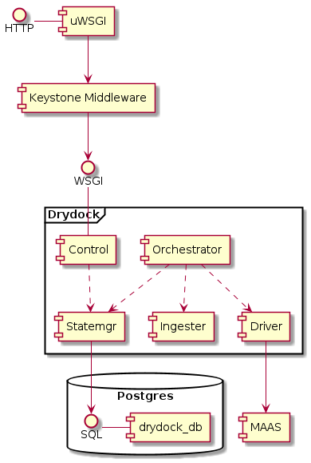

..
      Copyright 2018 AT&T Intellectual Property.
      All Rights Reserved.

      Licensed under the Apache License, Version 2.0 (the "License"); you may
      not use this file except in compliance with the License. You may obtain
      a copy of the License at

          http://www.apache.org/licenses/LICENSE-2.0

      Unless required by applicable law or agreed to in writing, software
      distributed under the License is distributed on an "AS IS" BASIS, WITHOUT
      WARRANTIES OR CONDITIONS OF ANY KIND, either express or implied. See the
      License for the specific language governing permissions and limitations
      under the License.

=============================
Developer Overview of Drydock
=============================

The core objective of Drydock is to fully deploy physical servers based on
a declarative YAML topology. The actual provisioning work is completed by
a downstream 3rd party tool managed by a pluggable driver. The initial use-case
is Canonical MAAS.

Architecture
============

At a very high level Drydock is a very simple workflow engine fronted by a RESTful
API and maintains state in a Postgres relational database. Clients create a task
via the API that defines two main attributes of an action and a reference to a site design
or topology. The Drydock orchestrator will asynchronously execute the task while
the client polls the API for task status. Once execution is complete, the task status
is updated with results and the orchestrator will move to the next queued task.

.. image:: images/basic_task_sequence.png
   :alt: Sequence diagram of basic task execution.

Components
==========

Control
-------

The ``control`` module is simply the RESTful API. It is based on the
`Falcon Framework <https://falconframework.org/>`_ and utilizes oslo_policy
for RBAC enforcement of the API endpoints. The normal deployment of Drydock
uses `uWSGI <http://uwsgi-docs.readthedocs.io/en/latest/>`_ and PasteDeploy
to build a pipeline that includes Keystone Middleware for authentication
and role decoration of the request.

Statemgr
--------

The ``statemgr`` module is the interface into all backing stores for Drydock.
This is mainly a `Postgres <https://www.postgresql.org/>`_, but Drydock
also uses the state manager for accessing external URLs to ingest site designs.
Interactions with Postgres use the core libraries of
`SQLAlchemy <https://docs.sqlalchemy.org/en/latest/core/tutorial.html>`_ (not the ORM).

Ingester
--------

The ``ingester`` module is basically a pluggable translator between external site definitions
(currently supports YAML formats) and the internal object model. Most of the internal object
model utilizes oslo_versionedobjects, much to my regret.

Orchestrator
------------

The ``orchestrator`` module is the brain of the task execution. It requests queued tasks
from the state manager and when one is available, it executes it. The orchestrator is
single-threaded in that only a single user-created task is executed at once. However, that
task can spawn many subtasks that may be executed concurrently depending on their synchronization
requirements. For some actions, the orchestrator creates subtasks that are handed off to the
driver for execution. A common question about this module is why Drydock doesn't use Celery
as a task management engine. The simple answer is that it wasn't considered due to unfamiliarity
at the time.

Driver
------

The ``driver`` module is a framework that supports pluggable drivers to execute task actions. The
subtle difference between the ``driver`` and ``orchestrator`` modules is the orchestrator manages
a wide scope of task execution that may cross the boundaries of a single driver plugin. Each driver
plugin is more focused on using a single downstream tool to accomplish the actions.

Developer Workflow / Test Cycle
===============================

Because Airship is a container-centric platform, the developer workflow heavily utilizes containers
for testing and publishing. It also requires Drydock to produce multiple artifacts that are related,
but separate: the Python package, the Docker image and the Helm chart. The code is published via the
Docker image artifact.

Drydock strives to conform to the `Airship coding conventions <http://airshipit.readthedocs.io/en/latest/conventions.html>`_.

Python
------

The Drydock Python codebase is under ``/drydock_provisioner`` and the testing is under ``/tests``. The
developer tools expect to run on Ubuntu 16.04 and you'll need GNU ``make`` available. With that you
should be able to use make targets for testing code changes:

  * ``make pep8`` - Lint the Python code against the PEP8 coding standard
  * ``make unit_tests`` - Run the local unit tests
  * ``make security`` - Scan the code with `Bandit <https://docs.openstack.org/bandit/latest/>`_
  * ``make coverage_test`` - Run unit tests and Postgres integration tests

Docker
------

The Drydock dockerfile is located in ``/images/drydock`` along with any artifacts built specifically
to enable the container image. Again make targets are used for generating and testing the artifacts.

  * ``make images`` - Build the Drydock Docker image. See :ref:`make-options` below.
  * ``make run_images`` - Build the image and then run a rudimentary local test

Helm
----

The Drydock helm chart is located in ``/charts/drydock``. Local testing currently only supports linting
and previewing the rendered artifacts. Richer functional chart testing is a TODO.

  * ``make helm_lint`` - Lint the Helm chart
  * ``make dry-run`` - Render the chart and output the Kubernetes manifest YAML documents

.. _make-options:

Makefile Options
----------------

The Makefile supports a few options that override default values to allow use behind
a proxy or for geneting the Docker image with custom tags.

  * ``DOCKER_REGISTRY`` - Defaults to ``quay.io``, used as the Docker registry for tagging images
  * ``IMAGE_NAME`` - Defaults to ``drydock``, the image name.
  * ``IMAGE_PREFIX`` - Defaults to ``airshipit``, the registry organization to push images into
  * ``IMAGE_TAG`` - Defaults to ``dev``, a tag to apply to the image
  * ``PUSH_IMAGE`` - Defaults to ``false``, set to ``true`` if you want the build process to also
                     push the image. Likely will require you have previously run ``docker login``.
  * ``PROXY`` - A HTTP/HTTPS proxy server to add to the image build environment. Required if you
                are building the image behind a proxy.
  * ``USE_PROXY`` - Defaults to ``false``, set to ``true`` to include the ``PROXY`` configuration
                    above in the build.
